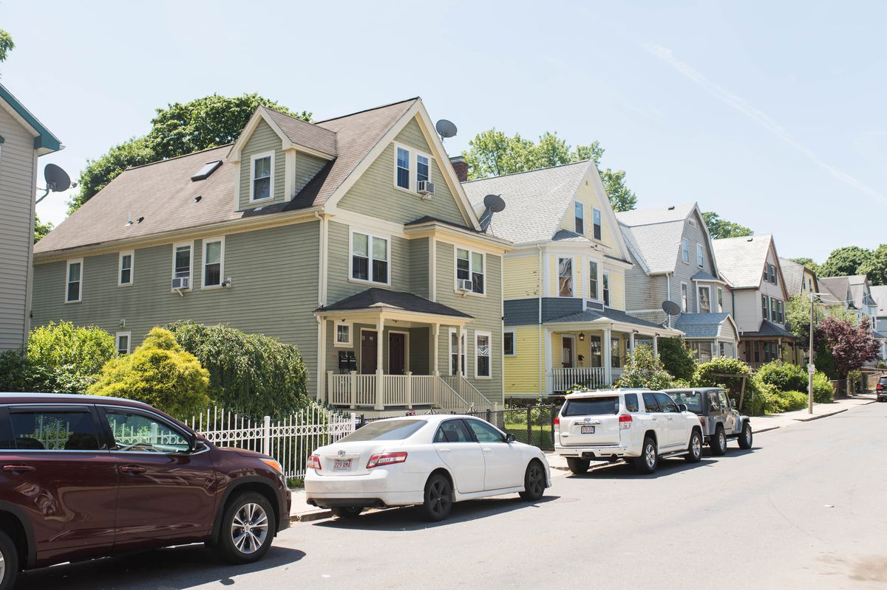

# Housing Price Prediction
You can find the WebApp at the following link to try the model:

[ُweb App](https://house-prices-predictions.streamlit.app/)


This project aims to predict house prices based on various features such as area, number of bedrooms, bathrooms, access to main road, and more. The model uses linear regression and standard scaling for input data.

## Table of Contents

- [Project Overview](#project-overview)
- [Features](#features)
- [Technologies Used](#technologies-used)
- [Data](#data)
- [Model](#model)
- [Usage](#usage)
- [File Structure](#file-structure)

## Project Overview

The goal of this project is to build a machine learning model that can predict house prices based on different features. We use a dataset containing various attributes such as area, number of bedrooms, bathrooms, main road access, parking, and more. The model is trained using a Linear Regression algorithm and deployed with Streamlit to make predictions through a web application.

## Features

- **Data Exploration**: Visualize the dataset and perform some basic statistics.
- **Correlation Heatmap**: Analyze the correlation between different features.
- **Price Prediction**: Predict house prices using a trained model with user input.
- **Visualizations**: Display histograms, scatter plots, and model performance visualizations.

## Technologies Used

- **Python**
- **Streamlit**: For creating an interactive web interface.
- **Pandas**: For data manipulation and analysis.
- **Scikit-learn**: For implementing machine learning models and data preprocessing.
- **Matplotlib & Seaborn**: For visualizations.
- **Pickle**: For saving and loading the trained model and scaler.

## Data

The dataset contains various features related to houses and their prices. The following columns are present in the dataset:

- `area`: The area of the house in square feet.
- `bedrooms`: The number of bedrooms.
- `bathrooms`: The number of bathrooms.
- `mainroad`: Whether the house is located near a main road (yes/no).
- `guestroom`: Whether the house has a guestroom (yes/no).
- `basement`: Whether the house has a basement (yes/no).
- `hotwaterheating`: Whether the house has hot water heating (yes/no).
- `airconditioning`: Whether the house has air conditioning (yes/no).
- `parking`: The number of parking spaces available.
- `furnishingstatus`: The furnishing status of the house (furnished, semi-furnished, or unfurnished).
- `price`: The price of the house (target variable).

## Model


The model used in this project is a **Linear Regression** model. The dataset is preprocessed by scaling both the features and target variable using **StandardScaler**. The model is trained on the scaled dataset and saved using **Pickle** for future use.

## Usage

1. Clone the repository to your local machine.
2. Install the required dependencies:
   ```bash
   pip install -r requirements.txt
